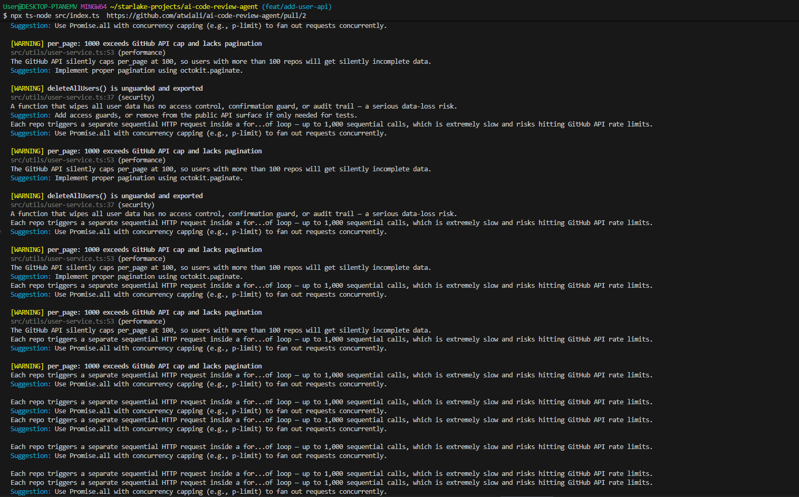
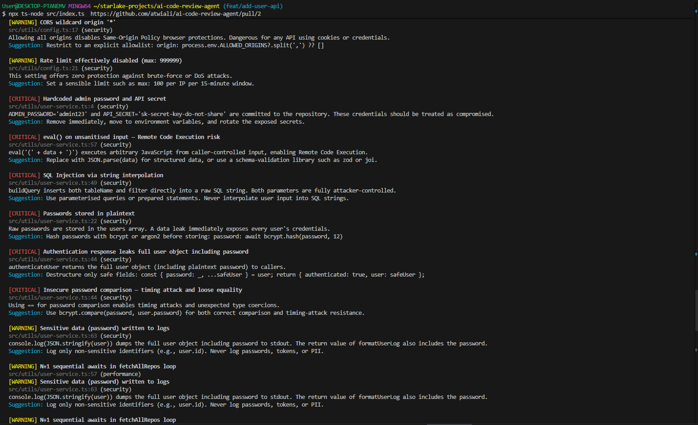
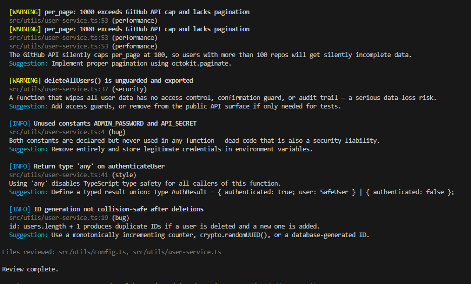
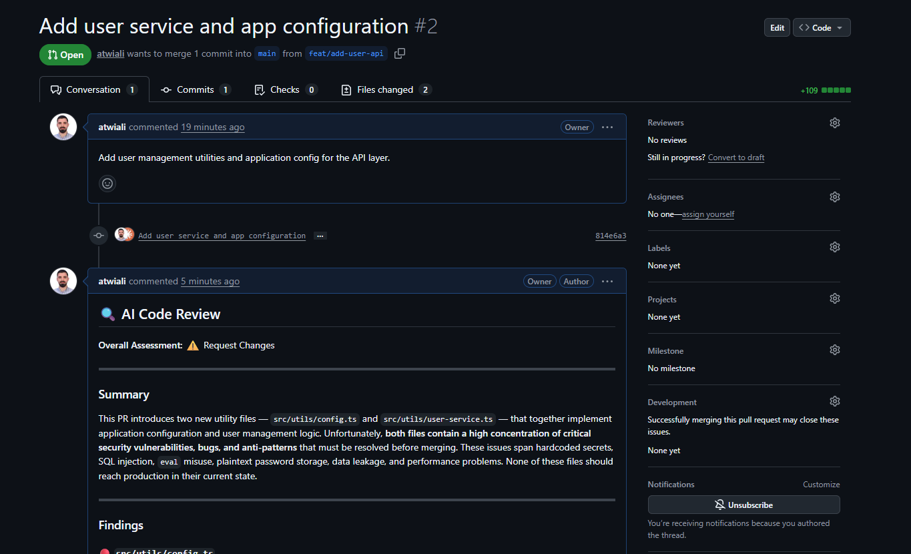

# Example: Running the AI Code Review Agent

This walkthrough shows a real run of the agent against [PR #2](https://github.com/atwiali/ai-code-review-agent/pull/2), which adds two files with intentional security and performance issues.

## Running the Command

```bash
npx ts-node src/index.ts https://github.com/atwiali/ai-code-review-agent/pull/2
```

## Step 1 — Agent Loop & Review Output

The agent starts by fetching the file list and diff, analyzes the code, posts a review comment on the PR, then prints a colored summary to the terminal:

```
Reviewing PR #2 in atwiali/ai-code-review-agent...
---

[Agent] Iteration 1...
[Thinking] Let me start by listing the changed files and fetching the diff simultaneously....
[Tool 1/20] list_pr_files(owner: "atwiali", repo: "ai-code-review-agent", pull_number: 2)
[Tool 2/20] fetch_pr_diff(owner: "atwiali", repo: "ai-code-review-agent", pull_number: 2)

[Agent] Iteration 2...
[Tool 3/20] post_review_comment(...)
[Result] Review comment posted successfully

[Agent] Iteration 3...
[Agent] Review complete. 3 iterations, 3 tool calls, 18884 tokens used.

=== AI Code Review ===

Overall: REQUEST_CHANGES

Summary:
This PR adds two new utility files — both files are riddled with critical security
vulnerabilities (hardcoded secrets, SQL injection, eval-based code injection,
plaintext passwords, data leakage), significant performance issues, and multiple
code-quality problems. None of these files should be merged in their current state.
```



## Step 2 — Findings

The agent found **18 issues** across both files — 8 critical, 7 warnings, 3 info.

### Critical & Warning Findings

```
[CRITICAL] Hardcoded database password in source code
  src/utils/config.ts:8 (security)
  Suggestion: Replace with an environment variable: password: process.env.DB_PASSWORD

[CRITICAL] eval() on unsanitised input — Remote Code Execution risk
  src/utils/user-service.ts:57 (security)
  Suggestion: Replace with JSON.parse(data) for structured data

[CRITICAL] SQL Injection via string interpolation
  src/utils/user-service.ts:49 (security)
  Suggestion: Use parameterised queries or prepared statements

[CRITICAL] Passwords stored in plaintext
  src/utils/user-service.ts:22 (security)
  Suggestion: Hash with bcrypt or argon2 before storing

[WARNING] N+1 sequential awaits in fetchAllRepos loop
  src/utils/user-service.ts:57 (performance)
  Suggestion: Use Promise.all with concurrency capping (e.g., p-limit)

[WARNING] JWT token expiry of 999 days
  src/utils/config.ts:13 (security)
  Suggestion: Use short-lived access tokens with a refresh-token strategy
```





## Step 3 — GitHub PR Comment

The agent automatically posts a formatted markdown review directly on the PR:



The comment includes:
- Overall assessment with emoji indicator (Approve / Request Changes / Comment)
- Summary of the PR and reviewer impression
- Every finding with severity, file, line number, description, and suggestion
- List of all files reviewed

## Stats

| Metric | Value |
|---|---|
| Iterations | 3 |
| Tool calls | 3 |
| Tokens used | ~18,884 |
| Files reviewed | 2 |
| Findings | 18 (8 critical, 7 warnings, 3 info) |
| Time | ~30 seconds |
| Estimated cost | ~$0.03 |
